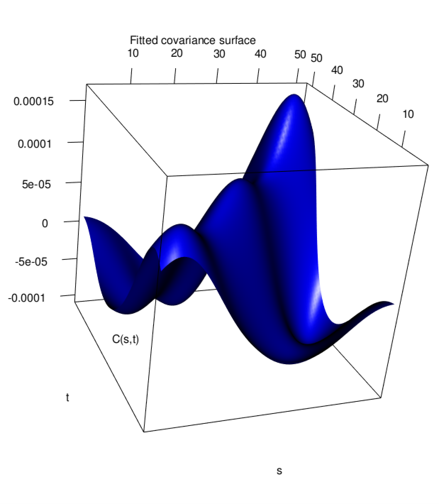
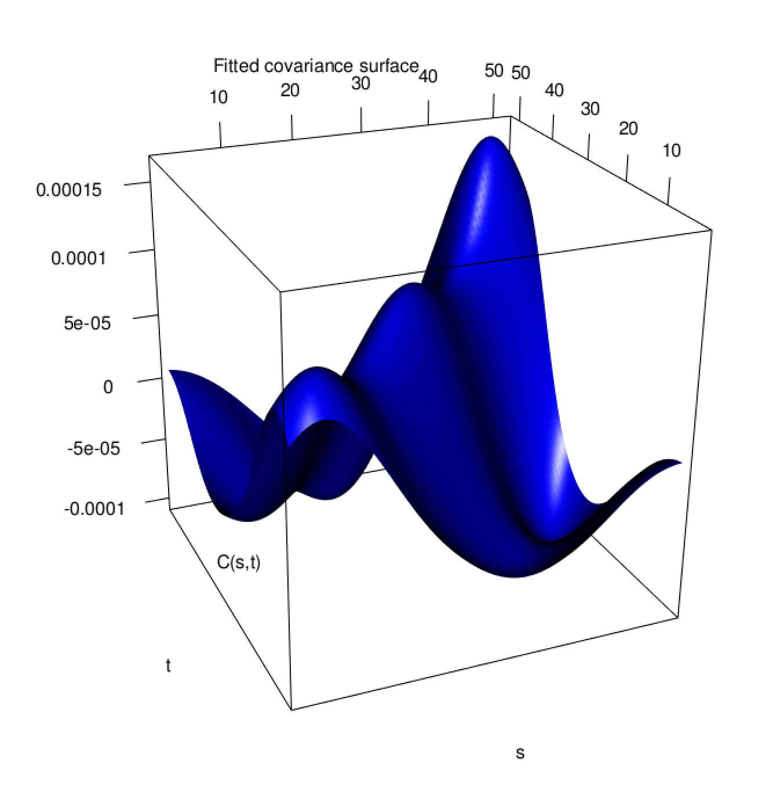

```{r setup, include=FALSE}
knitr::opts_chunk$set(echo = TRUE)
setwd("~/Desktop/Wild_Davis/capstone")

library(knitr)
library(fdapace)
library(ggrepel)
library(magrittr)
library(ggplot2)
library(dplyr)
library(tidyr)
library(gganimate)
library(gifski)
library(gapminder)
```

## Introduction

Citizen science projects like iNaturalist are becoming more credible as sources of research-grade data. While species which evade observation can create species-specific biases in the absolute counts of the data, studies concerning within-species relative abundance may sidestep these issues by assuming that such reporting biases are uniform in time. Here we consider the relative abundance of 47 species of birds in Northern California over the 52 weeks of 2019. The number of observations for a given species per week is obtained from iNaturalist, accessed from their API using the R package 'spocc'. Seasonality curves are then constructed from iNaturalist observations using techniques from kernel density estimation. The resulting seasonal trends may then be viewed as a sample of random curves (more specifically, probability densities) and can be studied under the framework of Functional Data Analysis. We will use functional principal component analysis to model the relative abundance of these species and identify a low-dimensional latent geometry which can be used to group similar bird species by their patterns of seasonality.


## From Points to Curves

For the $i^{th}$ species during the $j^{th}$ week, we observe the number of observations reported on iNaturalist, $X_{ij},~i=1,...,47,~j=1,...,52$. Using a Gaussian kernel $K(u) = \dfrac{1}{\sqrt{2\pi}}e^{-\frac{1}{2}u^2}$ we obtain estimates for the seasonality curves given by:

$$f_i(t) = \dfrac{1}{52h}\sum_{j=1}^{52}K(\dfrac{t-x_{ij}}{h}),$$

where the bandwidth $h$ is a tuning parameter which modulates smoothness of curves and is chosen here to be $6$ weeks. The estimated densities for the 47 birds are shown below.

```{r, echo = FALSE}

birds = read.csv("birds.csv")

# ggplot(birds, aes(x = x, y = dens, color = species)) +
#   geom_line() + 
#   theme(legend.position = "none")


inputs = MakeFPCAInputs(IDs = birds$species, tVec = birds$x, yVec = birds$dens)


fpca_obj = FPCA(Lt = inputs$Lt, Ly = inputs$Ly)

# plot(fpca_obj)
# plot(fpca_obj$xiEst[,1], fpca_obj$xiEst[,2])

meandf = data.frame(x = fpca_obj$workGrid, mean =  fpca_obj$mu)
constdf = data.frame(x = fpca_obj$workGrid, mean = 1/51)

ggplot() +
  geom_line(data = birds, 
            mapping = aes(x = x, y = dens, group = species),
            color=grey(0.3, alpha = 0.5)) + 
  geom_line(data = meandf, mapping = aes(x = x, y = mean),
            lwd = 1.5) + 
  #geom_line(data = constdf, mapping = aes(x = x, y = mean),
  #          lty = 2, col = 'red') + 
  theme(legend.position = "none")
```

The bold black curve denotes the pointwise mean seasonality, which is roughly constant with a slight skew toward the later weeks of the year. This suggests we have captured mostly a good variety of seasonalities, though perhaps later seasonalities are over-represented: if we only captured autumnal birds for example, this peak would be much more pronounced. Note the 5 "outlier" curves which stand out above the crowd. These curves represent birds which demonstrate extreme seasonality for each season, with winter being split into "early winter" and "late winter". This is the first sign of an interesting geometric phenomenon present in this data: we expect each season to correspond to one peak, but because the calendar year splits artificially the winter months, the corresponding peak gets split into two. The Ferruginous hawk's seasonality exemplifies this: it has a global maximum during the early weeks, but experiences another local maximum toward the end of the year. If we could recognize the underlying geometry on which these curves lie, a kernel density estimate would join these two peaks into one! We will investigate this geometry further using functional principal component analysis, which will also perform dimension reduction on the curves and facilitate comparisons in seasonality patterns across species.


```{r, echo = FALSE}
idx = c(5,8,21,44,30)

birdspecies = birds$species %>% unique 

highlight = birdspecies[idx]

hltcolors <- scales::hue_pal()(15)[c(6,4,2,12,9)]


ggplot() +
  geom_line(data = birds, 
            mapping = aes(x = x, y = dens, group = species),
            color=grey(0.3, alpha = 0.5)) + 
  geom_line(data = meandf, mapping = aes(x = x, y = mean),
            lwd = 2) + 
  geom_line(data = birds %>% filter(species %in% highlight), 
            mapping = aes(x = x, y = dens, group = species, color = species),
            lwd = .75) + 
  geom_text_repel(data = birds %>% filter(species %in% highlight) %>% 
                    group_by(species) %>% filter(dens == max(dens)),
                  mapping = aes(x = x, 
                                y = dens,
                                label = species),
                  size = 3.5,
                  min.segment.length=0)  +
  scale_color_manual(name = "", values=hltcolors) + 
  theme(legend.position = "none")
```


## Functional Principal Component Analysis

While a curve-based representation of seasonality is intuitive and easy to read for an individual species, understanding and comparing the trends of several species at a time is more difficult, as evidenced by the crowded figure displayed above. This difficulty can be attributed to the high-dimensional nature of curves: an infinite number of individual data points make up a single curve observation. Variation in each of these dimensions can represent major trends of variation which should be understood, or can be minor noise more analogous to random noise. To understand the difference and identify the main patterns of variation in the curves, functional principal component analysis (FPCA) can afford us a low dimensional representation of the curves based on the Karhunen-Lo\`eve decomposition for stochastic processes. We describe the technical machinery in the appendix and display the results of FPCA here.

The first step in FPCA is to estimate the covariance surface for the sample of curves. The undulating shape of the surface indicates that prevalence is normally negatively correlated between its peak time and other seasons. The only exception is near the ends of the time domain, caused by the break in the winter season. Here we see the covariance rise back up to positive values, which suggests that January counts are associated with December counts, though this association is not as strong as that seen within immediately neighboring time points. Intuitively this makes sense to us, but because FPCA does not understand the periodicity of a calendar year it tries to model this correlation through these edge peaks.


**tesselate the covariance**

```{r, echo = FALSE}

inputs = MakeFPCAInputs(IDs = birds$species, tVec = birds$x, yVec = birds$dens)


fpca_obj = FPCA(Lt = inputs$Lt, Ly = inputs$Ly)
#CreateCovPlot(fpca_obj, 'Fitted',
#              isInteractive = TRUE)
```


```{r  out.width = "75%", echo = FALSE}
 
# 
```

Using the functional analogue of spectral decomposition we can obtain the eigenfunctions of this surface and their corresponding scores for each individual species. The results are displayed below, using a 2-dimensional truncation which captures 90\% of the original variation:


```{r  echo = FALSE}
eigendf = data.frame(x = fpca_obj$workGrid,
                     eigen1 = fpca_obj$phi[,1],
                     eigen2 = fpca_obj$phi[,2])

eigendf_long = eigendf %>% pivot_longer(cols = starts_with("eigen"))
names(eigendf_long) = c("t", "eigenfn", "value")

scoredf = data.frame(species = birdspecies, FPC1 = fpca_obj$xiEst[,1], FPC2 = fpca_obj$xiEst[,2])

ggplot(eigendf_long , aes(x = t, y = value, color = eigenfn)) + 
  geom_line() 

# ggplot(scoredf, aes(x = FPC1, y = FPC2)) + 
#   geom_point() + 
#   geom_text_repel(
#     mapping = aes(x = FPC1, 
#         y = FPC2,
#         label = species),
#     size = 2.5,min.segment.length=0)

hltcolors <- scales::hue_pal()(15)[c(6,4,2,12,9)]

ggplot(scoredf, aes(x = FPC1, y = FPC2)) + 
  geom_point() + 
  xlim(c(-0.15,0.15)) + 
  geom_text_repel(
    mapping = aes(x = FPC1, 
        y = FPC2,
        label = species),
    size = 2.5,min.segment.length=0) +
  annotate("rect", xmin = Inf, xmax = 0, ymin = Inf, ymax = 0, fill= "#E58700", alpha = 0.2) +
  annotate("rect", xmin = -Inf, xmax = 0, ymin = -Inf, ymax = 0 , fill= "#00BA38", alpha = 0.2) + 
  annotate("rect", xmin = 0, xmax = Inf, ymin = 0, ymax = -Inf, fill= "#B983FF", alpha = 0.2) + 
  annotate("rect", xmin = 0, xmax = -Inf, ymin = Inf, ymax = 0, fill= "#A3A500", alpha = 0.2) 

```

The first eigenfunction represents a contrast between late spring and early winter: species with high FPC1 scores will be more common in early winter and less prevalent in spring. The second eigenfunction follows a similar shape but is shifted in time: species with high FPC2 score will be more prevalent during summer and less common during late winter. In the FPC score plot, we can group species together much more clearly than we could using only their curve representations. For example, the Oregon and Dark-Eyed Juncos exhibit very similar patterns of seasonality: with high FPC2 scores we can understand that these birds exhibit summer seasonality. 


If we look at the species on the edge of the point clouds, we recognize them as the outlier species highlighted before. They represent archetypal trends for each season. Summer is in the upper left corner, while winter is in the lower left. The flow of time corresponds to a clockwise rotation through FPC space: if we start at the bottom with the Ferruginous hawk and sweep left we pass through all of the seasons before returning back to winter. Another striking observation is that the point cloud forms a ring, mimicking the circular interpretation of seasonality. This suggests that the birds in our sample are highly seasonal with only a few showing constant levels of prevalence throughout the year. 

```{r  echo = FALSE}
hltcolors <- scales::hue_pal()(15)[c(6,4,2,12,9)]

ggplot() + 
  geom_point(data = scoredf, 
             mapping = aes(x = FPC1, y = FPC2)) + 
  geom_point(data = scoredf %>% filter(species %in% highlight), 
             mapping = aes(x = FPC1,
                           y = FPC2,
                           color = species)) + 
  xlim(c(-0.15,0.15)) + 
  geom_text_repel(data = scoredf %>% filter(species %in% highlight),
    mapping = aes(x = FPC1, 
                  y = FPC2,
                  label = species,
                  color = species),
    size = 3,min.segment.length=0) +
  scale_color_manual(name = "", values=hltcolors) +
  annotate("rect", xmin = Inf, xmax = 0, ymin = Inf, ymax = 0, fill= "#E58700", alpha = 0.2) +
  annotate("rect", xmin = -Inf, xmax = 0, ymin = -Inf, ymax = 0 , fill= "#00BA38", alpha = 0.2) + 
  annotate("rect", xmin = 0, xmax = Inf, ymin = 0, ymax = -Inf, fill= "#B983FF", alpha = 0.2) + 
  annotate("rect", xmin = 0, xmax = -Inf, ymin = Inf, ymax = 0, fill= "#A3A500", alpha = 0.2) +
  theme(legend.position = "none")
```


```{r  echo = FALSE, out.width = "75%"}

negcircledf = data.frame(x = seq(.1,-.1, length.out = 25))
negcircledf = negcircledf %>% mutate(y = -sqrt(round(.01-negcircledf$x^2, 10)))

poscircledf = data.frame(x = seq(-.1,.1, length.out = 25))
poscircledf = poscircledf %>% mutate(y = sqrt(round(.01-negcircledf$x^2, 10)))

circle = bind_rows(negcircledf, poscircledf) %>% unique


test = bind_rows(negcircledf, poscircledf) %>% unique

test  = test %>% mutate(t = seq(1,48))

colors <- scales::hue_pal()(48)

test = test %>% mutate(colors = colors)

circ = ggplot() + 
  geom_point(data = test, 
             mapping = aes(x = x, y = y)) + 
  xlim(c(-0.15,0.15)) + 
  annotate("rect", xmin = Inf, xmax = 0, ymin = Inf, ymax = 0, fill= "#E58700", alpha = 0.2) +
  annotate("rect", xmin = -Inf, xmax = 0, ymin = -Inf, ymax = 0 , fill= "#00BA38", alpha = 0.2) + 
  annotate("rect", xmin = 0, xmax = Inf, ymin = 0, ymax = -Inf, fill= "#B983FF", alpha = 0.2) + 
  annotate("rect", xmin = 0, xmax = -Inf, ymin = Inf, ymax = 0, fill= "#A3A500", alpha = 0.2) +
  theme(legend.position = "none")

anim <- circ +
  transition_time(t) +
  ease_aes('linear')

anim

```

```{r  echo = FALSE, out.width = "75%"}

fit = function(t){
  out = fpca_obj$mu + circle[t,1]*fpca_obj$phi[,1] + circle[t,2]*fpca_obj$phi[,2]
  return(out)
}

df_list = list()

for(t in 1:48){
  df_list[[t]] = data.frame(t = t, x = fpca_obj$workGrid,dens = fit(t))
}

curvesdf = bind_rows(df_list)

curves = ggplot() + 
  geom_line(data = curvesdf, 
             mapping = aes(x = x, y = dens, group = t)) + 
  theme(legend.position = "none")

anim2 <- curves +
  transition_time(t) +
  ease_aes('linear')

anim2
```


## Appendix

### Functional PCA
We consider a generic seasonality curve $f(t), ~t\in\mathcal{T}=[1,52]$ with mean curve $\mu(t) = E(f(t))$ and covariance surface $G(s,t)=\text{Cov}(f(s),f(t))$, which has eigenfunctions $\varphi_1(t),\varphi_2(t),\dots$. The Karhunen--Lo\`eve representation theorem states that
\begin{equation}
f(t) = \mu(t)+\sum_{k=1}^\infty \xi_k \varphi_k(t), \label{eq:KL}
\end{equation}
where the scores $\xi_k = \int_\mathcal{T} (C(t) - \mu(t)) \varphi_k(t) dt$ satisfy $E(\xi_k) = 0$, $\text{Var}( \xi_k) = \lambda_k$ and $E(\xi_k \xi_l) = 0$ for $k \neq l$. Here $\xi_k$ is the functional principal component score (FPC) of $X(\cdot)$ associated with the $k^{\text{th}}$ eigenfunction $\varphi_k$. Thus, the FPC scores are projections of the centered stochastic process onto the directions given by the eigenfunctions and summarize how a function changes from the mean curve along the principal modes of variations. Moreover, the centered process is equivalent to the infinite-dimensional vector $\xi_1, \xi_2, \dots$.

By truncating the vector representation to a finite number of $K$ components one achieves dimension reduction and can approximate the original stochastic process through its most important modes of variations. That is, FPCA provides a fit of the original curve
\begin{equation}
\hat{f}(t) = \hat{\mu}(t)+\sum_{k=1}^K \hat{\xi}_k \hat{\varphi}_k(t)
\end{equation}


